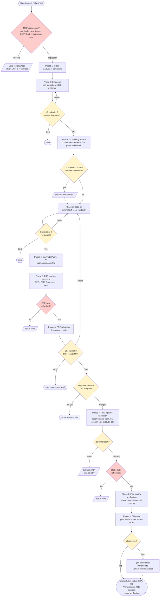
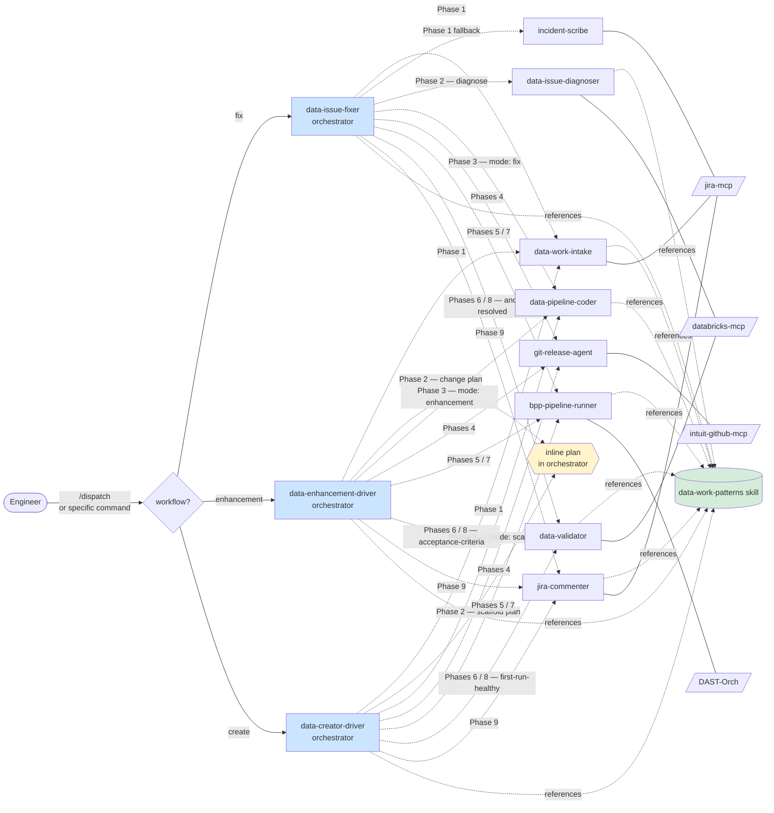

# data-forge — Claude Code plugin

End-to-end automation for three data-pipeline workflows in ETL codebases:

- **fix** (`/data-issue-fix`) — resolve a bug or data anomaly. Jira intake → diagnosis → code fix → PRF validation → BPP pipeline → post-deploy verification → Jira close-out. **Three checkpoints** (post-diagnosis, pre-commit, post-PRF).
- **enhancement** (`/data-enhancement`) — implement a non-bug change against an existing pipeline. Jira intake → scope & change plan → code change → PRF validation → BPP pipeline → post-deploy verification → Jira close-out. **Two checkpoints** (pre-commit, post-PRF). The plan is reviewed inline.
- **create** (`/data-creator`) — scaffold a net-new pipeline (config, code, or both). Intake (Jira preferred, freeform spec accepted) → scaffold plan → scaffold code → PRF dry-run → first-run verification → BPP pipeline → close-out. **Two checkpoints** (pre-commit, post-PRF). PRF iteration before PRD is expected.

Each workflow has its own orchestrator and command. A top-level `/dispatch` command prompts for the workflow when it's not specified. All three share the same agent roster (intake, coder, validator, git-release, BPP runner, jira-commenter) — the validator and coder switch behavior based on a `mode` passed by the orchestrator.

Ships from the `intuit-de` marketplace (this repo), which may grow to host additional data-engineering plugins over time. The plugin itself lives at `data-forge/` inside the repo.

## Install

Claude Code installs plugins from **marketplaces**, not directly from plugin repos. This repo ships its own marketplace manifest (`.claude-plugin/marketplace.json`), so installing is two steps: register the `intuit-de` marketplace, then install the `data-forge` plugin from it.

### Prerequisites

Before installing, make sure you can clone this repo from GHE. Claude Code clones the marketplace repo on your behalf when you run `/plugin marketplace add`, so whatever auth `git clone` needs must already be set up.

- **SSH clone** (recommended): your SSH key must be registered at `github.intuit.com`. Test with `ssh -T git@github.intuit.com` — you should see a greeting, not a permission-denied error.
- **`gh` CLI** (optional but handy for the workflow itself): authenticated against `github.intuit.com` — `gh auth status --hostname github.intuit.com`.
- All [required MCPs](#required-mcps) connected — the orchestrator fails fast if any are missing.

### 1. Register the marketplace (once per machine)

Run this inside any Claude Code session:

```
/plugin marketplace add git@github.intuit.com:RiskDataAnalytics/claude-de-plugins.git
```

Claude Code clones the repo, reads `.claude-plugin/marketplace.json`, and registers the `intuit-de` marketplace locally. You only need to do this once per machine — the marketplace stays registered across sessions.

### 2. Install the plugin

```
/plugin install data-forge@intuit-de
```

The `@intuit-de` suffix tells Claude Code which marketplace to resolve `data-forge` from. Commands (`/data-forge:data-issue-fix`) and agents (`data-forge:data-issue-diagnoser`, etc.) become available immediately.

### Verify

```
/plugin marketplace list
/plugin list
```

You should see `intuit-de` in the marketplace list and `data-forge` in the plugin list.

### Update later

When the plugin ships a new version (anyone on the team merges changes to `master`), pull the update:

```
/plugin marketplace update intuit-de
/plugin install data-forge@intuit-de
```

### Uninstall

```
/plugin uninstall data-forge
/plugin marketplace remove intuit-de
```

### Local development

When iterating on the plugin before pushing, point Claude Code at your local checkout instead of the GHE repo. Use the absolute path to your clone:

```
/plugin marketplace add ~/Documents/GitHub/claude-de-plugins
/plugin install data-forge@intuit-de
```

Changes to agent/skill files in the checkout are picked up on the next Claude Code session (no reinstall needed). If you edit `data-forge/.claude-plugin/plugin.json` or the root `.claude-plugin/marketplace.json`, run `/plugin marketplace update intuit-de` to refresh.

### Troubleshooting install failures

- **`fatal: Could not read from remote repository` / SSH permission denied** — your SSH key isn't set up for `github.intuit.com`. Re-check `ssh -T git@github.intuit.com`.
- **`marketplace.json: schema validation failed`** — you're on an older, broken version of the manifest. Run `/plugin marketplace update intuit-de` to pull the current one, or remove and re-add the marketplace.
- **Plugin installs but commands don't appear** — restart Claude Code; plugins are loaded at session start.

## Use

Pick the command that matches the workflow:

```
/data-forge:data-issue-fix JIRA-XXXX           # bug / data anomaly
/data-forge:data-enhancement JIRA-XXXX         # change to existing pipeline
/data-forge:data-creator JIRA-XXXX             # net-new pipeline (Jira)
/data-forge:data-creator "<freeform spec>"     # net-new pipeline (no ticket yet)
```

If you're not sure which one, the dispatcher asks:

```
/dispatch                                      # asks for input + workflow
/dispatch JIRA-XXXX                            # asks for workflow only
/dispatch JIRA-XXXX enhancement                # no prompts
```

Or invoke any specialist sub-agent directly:

```
Agent(data-forge:data-issue-diagnoser, "why is last_routing_number 97% NULL since Dec 2025?")
Agent(data-forge:bpp-pipeline-runner, "run pipeline for JIRA-XXXX")
Agent(data-forge:data-validator, "verify JIRA-XXXX on schema_name.table_name after commit <commit-sha>, mode: anomaly-resolved")
```

## Required MCPs

The plugin requires four MCPs to be connected at the user level **before** running any command. These are non-negotiable prerequisites — each orchestrator probes them at the start of every run and refuses to proceed if any is missing.

| MCP | Required for |
|---|---|
| `jira-mcp` | reading tickets, posting comments, transitioning status |
| `databricks-mcp` | running diagnostic and verification SQL |
| `DAST-Orch` | executing BPP pipelines (PRF and PRD) |
| `intuit-github-mcp` | opening pull requests |

If any are not connected when you start, you'll get an immediate `Missing MCP: <name>` message. Connect the missing one and re-run.

(The create flow's Phase 1 will also accept a freeform spec when no Jira ticket exists yet — `jira-mcp` is then not required for that single run. The other three are still mandatory.)

## Workflow diagram — fix flow

The fix orchestrator (`data-issue-fixer`) runs nine phases plus a working-branch pre-flight (Phase 3a). Three checkpoints (post-diagnosis, pre-commit, post-PRF-validation) gate on engineer approval. Destructive actions (Jira posts, git commits, git push, PR creation, BPP execution) always require explicit approval even inside an approved checkpoint.

The enhancement and create flows follow the same shape with two differences: Phase 2 is "scope & plan" (reviewed inline, no separate post-plan checkpoint) instead of diagnosis, and the validator runs in `acceptance-criteria` mode (enhancement) or `first-run-healthy` mode (create) instead of `anomaly-resolved`. The diagram below shows the fix flow as the canonical example.



**Legend:** yellow = engineer-gated decision; red = hard gate / fail-fast check.

## Agent roster map

Three orchestrators (one per workflow) share a common roster of specialist sub-agents. Each orchestrator owns its phase flow; sub-agents own their scoped work and are reused across workflows. The shared `data-work-patterns` skill is the single source of truth for templates, methods, and SQL.



Every sub-agent can be invoked standalone (e.g., `Agent(data-issue-diagnoser, ...)`). Read-only sub-agents return findings and suggest the next step. Write sub-agents always gate before any write, regardless of invocation path.

## Repo layout

```
claude-de-plugins/                    ← git repo root (intuit-de marketplace)
├── .claude-plugin/
│   └── marketplace.json              ← marketplace manifest (stays at root)
├── README.md
└── data-forge/                       ← the plugin itself
    ├── .claude-plugin/
    │   └── plugin.json
    ├── agents/
    ├── commands/
    └── skills/
        └── data-work-patterns/
```

The root `marketplace.json` points at `data-forge/` via a relative `source` (`"./data-forge"`), so a single repo can ship multiple plugins as sibling directories in the future — each entry in `plugins[]` just points at its own folder.

## Architecture

Two pieces, working together:

### Agents (`data-forge/agents/`)
Isolated workflow executors. Each runs in a fresh conversation context.

**Orchestrators (one per workflow):**

- `data-issue-fixer` — fix flow (bug / data anomaly)
- `data-enhancement-driver` — enhancement flow (change to existing pipeline)
- `data-creator-driver` — create flow (net-new pipeline)

**Shared sub-agents (used by all three orchestrators):**

- `data-work-intake` — reads a Jira ticket + comments (or a freeform spec for create flow)
- `data-issue-diagnoser` — root-cause analysis (fix flow only)
- `data-pipeline-coder` — implements approved changes; modes: `fix` | `enhancement` | `scaffold`
- `bpp-pipeline-runner` — executes BPP pipeline (PRF and PRD)
- `data-validator` — verification; modes: `anomaly-resolved` | `acceptance-criteria` | `first-run-healthy`
- `jira-commenter` — posts Jira comments; optionally transitions the ticket to a terminal status
- `git-release-agent` — commit / push / PR
- `incident-scribe` — structures raw incident reports (used by fix flow's Phase 1 fallback)

### Skill (`data-forge/skills/data-work-patterns/`)
Shared reference library the agents delegate to — diagnostic and change-planning methods, comment templates, plan templates, mode-aware SQL skeletons, guardrails. Updates here propagate to all agents without editing agent files. Referenced inside agent prompts as `${CLAUDE_PLUGIN_ROOT}/skills/data-work-patterns/...` (where `${CLAUDE_PLUGIN_ROOT}` resolves to `data-forge/`).

```
data-work-patterns/
├── SKILL.md
├── refs/
│   ├── diagnostic-method.md      ← rule-out pattern (fix flow)
│   ├── change-plan-method.md     ← scope-and-plan pattern (enhancement & create)
│   ├── worked-examples.md        ← real case studies (bridges, control groups, red herrings)
│   └── guardrails.md             ← approval policy, checkpoints, non-negotiables
├── templates/
│   ├── intake-report.md
│   ├── diagnosis-report.md       ← fix flow output
│   ├── enhancement-plan.md       ← enhancement flow Phase 2 output
│   ├── scaffold-plan.md          ← create flow Phase 2 output
│   ├── validation-report.md      ← mode-aware: A / B / C sections
│   ├── jira-investigation-comment.md
│   ├── jira-verification-comment.md
│   └── jira-cr-format.md
└── sql/
    └── verification-queries.sql  ← three sections:
                                       A — anomaly-resolved (fix)
                                       B — acceptance-criteria (enhancement)
                                       C — first-run-healthy (create)
```

## Roster summary

| Agent | Tools | Writes? |
| --- | --- | --- |
| `data-issue-fixer` (fix orchestrator) | Agent + full | yes (via sub-agents) |
| `data-enhancement-driver` (enhancement orchestrator) | Agent + full | yes (via sub-agents) |
| `data-creator-driver` (create orchestrator) | Agent + full | yes (via sub-agents) |
| `data-work-intake` | Read, Grep, Glob | no |
| `data-issue-diagnoser` | Read, Grep, Glob, Bash | no |
| `data-pipeline-coder` | Read, Edit, Write, Grep, Glob, Bash | edits/creates files, no commit |
| `bpp-pipeline-runner` | Read, ScheduleWakeup | BPP only, with approval |
| `data-validator` | Read, Bash | no |
| `jira-commenter` | Read | Jira comments + ticket transitions, with approval |
| `git-release-agent` | Bash, Read | git only, with approval |
| `incident-scribe` | Read, Grep, Glob | Jira only, with approval |

## Guardrails

See `data-forge/skills/data-work-patterns/refs/guardrails.md` for the full policy. Quick reference:

- **Code edits:** allowed without asking
- **Jira comments:** always ask first
- **Git commits / pushes / PRs:** always ask at every step
- **BPP pipeline execution:** always ask; never silently default to PRD; never poll GitHub to auto-trigger on merge
- **Verification:** refuses to run against un-refreshed data (non-negotiable)
- **Scope creep:** second bugs noted, primary fix stays focused

## Checkpoints

Per workflow:

| Workflow | Checkpoints |
| --- | --- |
| **fix** (`data-issue-fixer`) | 1. Post-diagnosis<br>2. Pre-commit (diff review)<br>3. Post-PRF (acceptance to proceed to PRD) |
| **enhancement** (`data-enhancement-driver`) | 1. Pre-commit (diff against approved plan)<br>2. Post-PRF (acceptance criteria pass) |
| **create** (`data-creator-driver`) | 1. Pre-commit (scaffold review)<br>2. Post-PRF (first-run-healthy pass) |

In the enhancement and create flows, the Phase 2 plan (change plan / scaffold plan) is **reviewed inline during Phase 2** — not as a separate post-plan checkpoint — so the engineer can refine/approve/stop without an explicit gate ceremony.

All checkpoints default-ON. "Skip checkpoint" is honored when the engineer is explicit but noted in the response for audit.

## Project context

The orchestrator reads `CLAUDE.md` (project root, parent dirs, `~/CLAUDE.md`) for conventions — Jira project key, catalog names, ETL script patterns. **No cross-session memory** — each run re-reads rather than recalling.

## Extending

- **New diagnostic pattern?** Add to `data-forge/skills/data-work-patterns/refs/worked-examples.md`. One case study per section; keep Situation / Insight / Lesson structure.
- **New Jira comment template?** Add to `data-forge/skills/data-work-patterns/templates/` and update `jira-commenter`'s template pointer list.
- **New verification check?** Add to the matching section (A / B / C) of `data-forge/skills/data-work-patterns/sql/verification-queries.sql` and mention it in `refs/diagnostic-method.md` (fix) or `refs/change-plan-method.md` (enhancement / create).
- **New workflow?** Add a new orchestrator in `agents/`, a matching command in `commands/`, a Phase 2 plan template in `templates/`, and a new section in `sql/verification-queries.sql` if the workflow needs its own check set. The validator and coder both accept new modes via their `mode` parameter — no code edits needed for the shared sub-agents.
- **New repo?** Ensure it has a `CLAUDE.md` describing its conventions and that its data warehouse MCP is connectable. No agent code changes required.

## Example session — fix flow

The fix flow has the most phases and is shown below as a representative example. The enhancement and create flows look similar, but Phase 2 is "scope & plan" reviewed inline (not a separate checkpoint), and validation runs in `acceptance-criteria` or `first-run-healthy` mode respectively.

```
> /data-issue-fix JIRA-XXXX

[Phase 1] Reading JIRA-XXXX... 4 comments. Last comment retracted
Payments 2.0 UNION approach. Currently awaiting validation of a
parallel-join fix using mt_txn_id.

Continue to diagnosis? (yes / stop)
> yes

[Phase 2] Diagnoser ran 8 queries. Root cause: join key mismatch —
Payments 2.0 payment_txn_id doesn't match legacy numeric txn_id.
Bridge is mt_txn_id (100% populated, same alphanumeric format).
Match rate tracks NULL rate to the percentage point.

CHECKPOINT 1: here's the diagnosis. Review before code changes?
> yes, looks right

[Phase 3] Coder: added _ihub_check_clear_pmt2_cte, parallel join,
COALESCE on 3 columns. Diff: +19 -30 lines, 1 file.

CHECKPOINT 2: here's the diff. Approve?
> yes

[Phase 4] Commit / push / PR?
> yes to all

[committed 6875fe0a, pushed, PR #742 opened]

[Phase 5] How do you want to run the fix against PRF?
  1. BPP pipeline
  2. EMR Serverless / local / other
  3. Skip (not recommended)
> 1, pipeline is ips_transactions_check_new_prf

[triggered PRF execution abc123, polling...
 ... 6m later: SUCCESS]

Has the PRF target table been refreshed? (yes / no)
> yes

[Phase 6] PRF validator: NULL% at 0.35% across Feb–Apr 2026.
Row count parity OK. Spot-check: 10/10. Cardinality preserved.

CHECKPOINT 3: PRF validation looks clean. Proceed to PRD?
> yes

Ready for PRD. Once you've merged the PR, let me know.
> merged

[Phase 7] Run the BPP pipeline now? Name from Jira 'Dev Portal
Asset Alias': `t_ips_transactions_check_new_pipeline`.
Env: PRD. (yes / switch to E2E / cancel)
> yes

[triggered PRD execution def456, polling...
 ... 4m later: SUCCESS]

Has the stable target table been refreshed? (yes / no)
> yes, refreshed this morning

[Phase 8] Stable validator: NULL% collapsed from 97% to 0.35%
across Feb–Apr 2026. Row count parity: diff = 0. Spot-check: 10/10.

[Phase 9] Post PRF + stable verification to Jira?
> yes

[jira-commenter posted comment 15291782]

Close JIRA-XXXX now? Available transitions: `Done`, `Cancelled`. (yes / skip)
> yes, Done

[transitioned JIRA-XXXX → Done]

Recap: JIRA-XXXX fixed (SHA 6875fe0a), status Done. PR #742 merged.
PRF validated, PRD pipeline succeeded. NULL% baseline restored in stable.
```

## Why this layout

- **Agents** run in isolated contexts → each orchestrator's context doesn't balloon.
- **Three orchestrators, one shared roster** → workflows differ only where they actually differ (intake framing, Phase 2 method, validator mode); the rest is shared code.
- **Skill** is the single source of truth for shared patterns → update in one place, all agents benefit. Adding a new workflow means adding one orchestrator + one command + one Phase 2 template + one SQL section, not duplicating the roster.
- **`mode` parameter on coder and validator** → behavior switches per workflow without forking the agents. Adding a fourth workflow later just means another mode value.
- **Templates** as separate files → easier to version, easier for engineers to tweak without agent prompt edits.
- **SQL skeletons** in their own file → can be copy-pasted into a Databricks notebook for ad-hoc investigation.
- **Worked examples** as a growing file → the system learns over time as patterns are added.
- **Plugin nested under `data-forge/`** → the `intuit-de` marketplace can ship additional plugins as sibling directories without restructuring.
