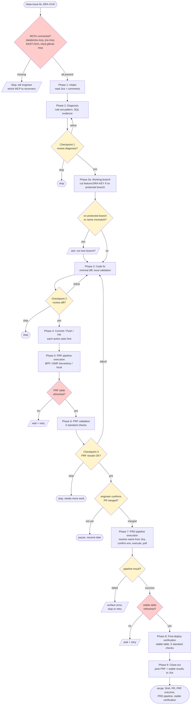
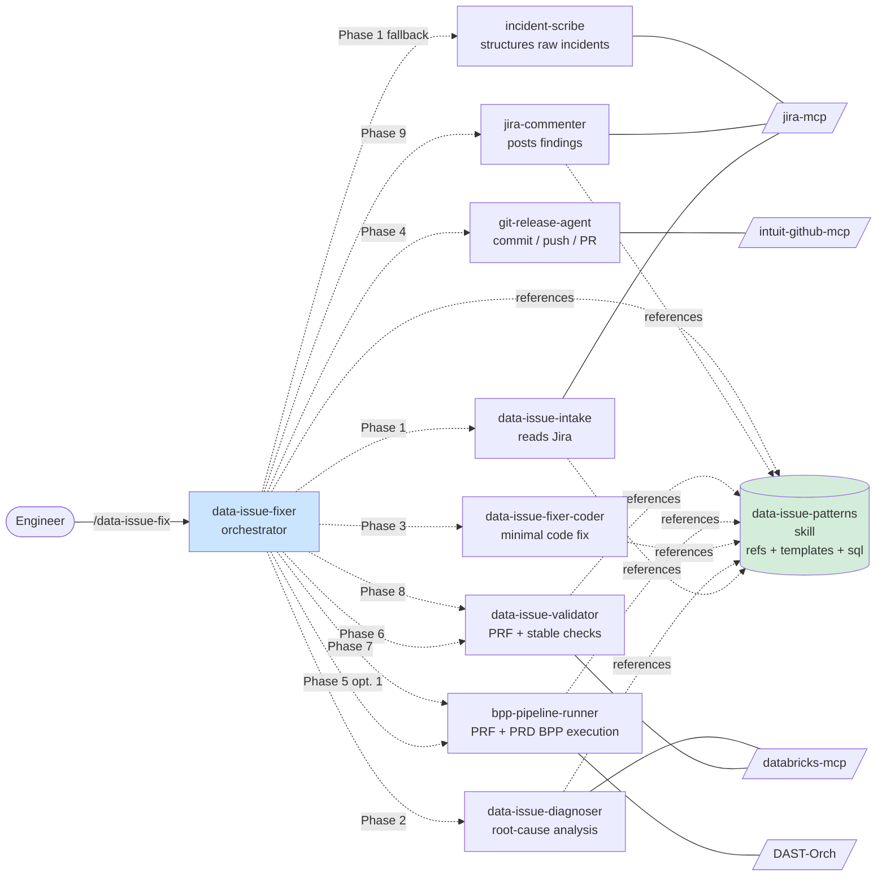

# ai-etl-data — Claude Code plugin

End-to-end resolution of data-issue Jira tickets in ETL codebases. Drives the full cycle (Jira intake → diagnosis → code fix → PRF validation → BPP pipeline → post-deploy verification → Jira close-out) via an orchestrator plus specialist sub-agents, with engineer approval at three checkpoints.

## Install

Claude Code installs plugins from **marketplaces**, not directly from plugin repos. This repo ships its own marketplace manifest (`.claude-plugin/marketplace.json`), so installing is two steps.

### Register the marketplace (once per machine)

```bash
/plugin marketplace add git@github.intuit.com:RiskDataAnalytics/ai-etl-data-plugin.git
```

### Install the plugin

```bash
/plugin install ai-etl-data@ai-etl-data-marketplace
```

### Verify

```bash
/plugin marketplace list
/plugin list
```

### Update later

```bash
/plugin marketplace update ai-etl-data-marketplace
/plugin install ai-etl-data@ai-etl-data-marketplace
```

### Uninstall

```bash
/plugin uninstall ai-etl-data
/plugin marketplace remove ai-etl-data-marketplace
```

### Local development

When iterating on the plugin before pushing, point Claude Code at your local checkout instead of the GHE repo:

```bash
/plugin marketplace add ~/Documents/GitHub/ai-etl-data-plugin
/plugin install ai-etl-data@ai-etl-data-marketplace
```

Changes to agent/skill files in the checkout are picked up on the next Claude Code session (no reinstall needed). If you edit `.claude-plugin/plugin.json` or `marketplace.json`, run `/plugin marketplace update ai-etl-data-marketplace` to refresh.

### Prerequisites

- `gh` CLI authenticated against `github.intuit.com` (`gh auth status --hostname github.intuit.com`)
- All [required MCPs](#required-mcps) connected — the orchestrator fails fast if any are missing

## Use

```
/ai-etl-data:data-issue-fix JIRA-XXXX
```

Or invoke any specialist sub-agent directly:

```
Agent(ai-etl-data:data-issue-diagnoser, "why is last_routing_number 97% NULL since Dec 2025?")
Agent(ai-etl-data:bpp-pipeline-runner, "run pipeline for JIRA-XXXX")
Agent(ai-etl-data:data-issue-validator, "verify JIRA-XXXX on schema_name.table_name after commit <commit-sha>")
```

## Required MCPs

The orchestrator fails fast if any of these are not connected:

- A data warehouse MCP (`databricks-mcp`, or equivalent for Redshift / BigQuery / Snowflake)
- `jira-mcp`
- `DAST-Orch`
- `intuit-github-mcp`

## Workflow diagram

The orchestrator runs nine phases plus a working-branch pre-flight (Phase 3a). Three checkpoints (post-diagnosis, pre-commit, post-PRF-validation) gate on engineer approval. Destructive actions (Jira posts, git commits, git push, PR creation, BPP execution) always require explicit approval even inside an approved checkpoint.



**Legend:** yellow = engineer-gated decision; red = hard gate / fail-fast check.

## Agent roster map

Each phase delegates to a specialist sub-agent. The orchestrator (`data-issue-fixer`) owns the phase flow; sub-agents own their scoped work.



Every sub-agent can be invoked standalone (e.g., `Agent(data-issue-diagnoser, ...)`). Read-only sub-agents return findings and suggest the next step. Write sub-agents always gate before any write, regardless of invocation path.

## Architecture

Two pieces, working together:

### Agents (`agents/`)
Isolated workflow executors. Each runs in a fresh conversation context.

- `data-issue-fixer` — orchestrator
- `data-issue-intake` — reads Jira ticket + comments
- `data-issue-diagnoser` — root-cause analysis
- `data-issue-fixer-coder` — implements code fix
- `bpp-pipeline-runner` — executes BPP pipeline post-merge
- `data-issue-validator` — post-deploy verification
- `jira-commenter` — posts Jira comments
- `git-release-agent` — commit / push / PR
- `incident-scribe` — structures raw incident reports

### Skill (`skills/data-issue-patterns/`)
Shared reference library the agents delegate to — diagnostic patterns, comment templates, SQL skeletons, guardrails. Updates here propagate to all agents without editing agent files. Referenced inside agent prompts as `${CLAUDE_PLUGIN_ROOT}/skills/data-issue-patterns/...`.

```
data-issue-patterns/
├── SKILL.md
├── refs/
│   ├── diagnostic-method.md    ← the rule-out pattern
│   ├── worked-examples.md      ← JIRA-XXXX patterns (bridges, control groups, red herrings)
│   └── guardrails.md           ← approval policy, checkpoints, non-negotiables
├── templates/
│   ├── intake-report.md
│   ├── diagnosis-report.md
│   ├── validation-report.md
│   ├── jira-investigation-comment.md
│   ├── jira-verification-comment.md
│   └── jira-cr-format.md
└── sql/
    └── verification-queries.sql
```

## Roster summary

| Agent | Tools | Writes? |
| --- | --- | --- |
| `data-issue-fixer` (orchestrator) | Agent + full | yes (via sub-agents) |
| `data-issue-intake` | Read, Grep, Glob | no |
| `data-issue-diagnoser` | Read, Grep, Glob, Bash | no |
| `data-issue-fixer-coder` | Read, Edit, Write, Grep, Glob, Bash | edits files, no commit |
| `bpp-pipeline-runner` | Read, ScheduleWakeup | BPP only, with approval |
| `data-issue-validator` | Read, Bash | no |
| `jira-commenter` | Read | Jira only, with approval |
| `git-release-agent` | Bash, Read | git only, with approval |
| `incident-scribe` | Read, Grep, Glob | Jira only, with approval |

## Guardrails

See `skills/data-issue-patterns/refs/guardrails.md` for the full policy. Quick reference:

- **Code edits:** allowed without asking
- **Jira comments:** always ask first
- **Git commits / pushes / PRs:** always ask at every step
- **BPP pipeline execution:** always ask; never silently default to PRD; never poll GitHub to auto-trigger on merge
- **Verification:** refuses to run against un-refreshed data (non-negotiable)
- **Scope creep:** second bugs noted, primary fix stays focused

## Checkpoints (flow mode)

Two checkpoints in the orchestrator:

1. **Post-diagnosis** — review root cause before code changes
2. **Pre-commit** — review diff before git commit

Both default-ON. "Skip checkpoint" is honored but noted in the response for audit.

## Project context

The orchestrator reads `CLAUDE.md` (project root, parent dirs, `~/CLAUDE.md`) for conventions — Jira project key, catalog names, ETL script patterns. **No cross-session memory** — each run re-reads rather than recalling.

## Extending

- **New diagnostic pattern?** Add to `skills/data-issue-patterns/refs/worked-examples.md`. One case study per section; keep Situation / Insight / Lesson structure.
- **New Jira comment template?** Add to `skills/data-issue-patterns/templates/` and update `jira-commenter`'s template pointer list.
- **New verification check?** Add to `skills/data-issue-patterns/sql/verification-queries.sql` and mention it in `refs/diagnostic-method.md`.
- **New repo?** Ensure it has a `CLAUDE.md` describing its conventions and that its data warehouse MCP is connectable. No agent code changes required.

## Example session

```
> /data-issue-fix JIRA-XXXX

[Phase 1] Reading JIRA-XXXX... 4 comments. Last comment retracted
Payments 2.0 UNION approach. Currently awaiting validation of a
parallel-join fix using mt_txn_id.

Continue to diagnosis? (yes / stop)
> yes

[Phase 2] Diagnoser ran 8 queries. Root cause: join key mismatch —
Payments 2.0 payment_txn_id doesn't match legacy numeric txn_id.
Bridge is mt_txn_id (100% populated, same alphanumeric format).
Match rate tracks NULL rate to the percentage point.

CHECKPOINT 1: here's the diagnosis. Review before code changes?
> yes, looks right

[Phase 3] Coder: added _ihub_check_clear_pmt2_cte, parallel join,
COALESCE on 3 columns. Diff: +19 -30 lines, 1 file.

CHECKPOINT 2: here's the diff. Approve?
> yes

[Phase 4] Commit / push / PR?
> yes to all

[committed 6875fe0a, pushed, PR #742 opened]

[Phase 5] How do you want to run the fix against PRF?
  1. BPP pipeline
  2. EMR Serverless / local / other
  3. Skip (not recommended)
> 1, pipeline is ips_transactions_check_new_prf

[triggered PRF execution abc123, polling...
 ... 6m later: SUCCESS]

Has the PRF target table been refreshed? (yes / no)
> yes

[Phase 6] PRF validator: NULL% at 0.35% across Feb–Apr 2026.
Row count parity OK. Spot-check: 10/10. Cardinality preserved.

CHECKPOINT 3: PRF validation looks clean. Proceed to PRD?
> yes

Ready for PRD. Once you've merged the PR, let me know.
> merged

[Phase 7] Run the BPP pipeline now? Name from Jira 'Dev Portal
Asset Alias': `t_ips_transactions_check_new_pipeline`.
Env: PRD. (yes / switch to E2E / cancel)
> yes

[triggered PRD execution def456, polling...
 ... 4m later: SUCCESS]

Has the stable target table been refreshed? (yes / no)
> yes, refreshed this morning

[Phase 8] Stable validator: NULL% collapsed from 97% to 0.35%
across Feb–Apr 2026. Row count parity: diff = 0. Spot-check: 10/10.

[Phase 9] Post PRF + stable verification to Jira?
> yes

[jira-commenter posted comment 15291782]

Recap: JIRA-XXXX fixed (SHA 6875fe0a). PR #742 merged. PRF validated,
PRD pipeline succeeded. NULL% baseline restored in stable. Jira updated.
```

## Why this layout

- **Agents** run in isolated contexts → orchestrator's context doesn't balloon.
- **Skill** is the single source of truth for shared patterns → update in one place, all agents benefit.
- **Templates** as separate files → easier to version, easier for engineers to tweak without agent prompt edits.
- **SQL skeletons** in their own file → can be copy-pasted into a Databricks notebook for ad-hoc investigation.
- **Worked examples** as a growing file → the system learns over time as patterns are added.
