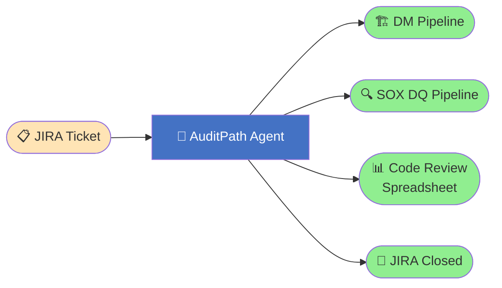
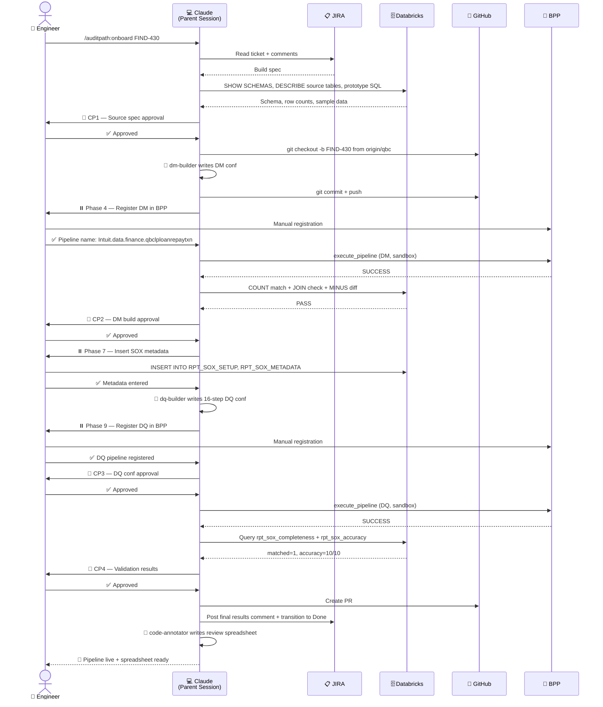
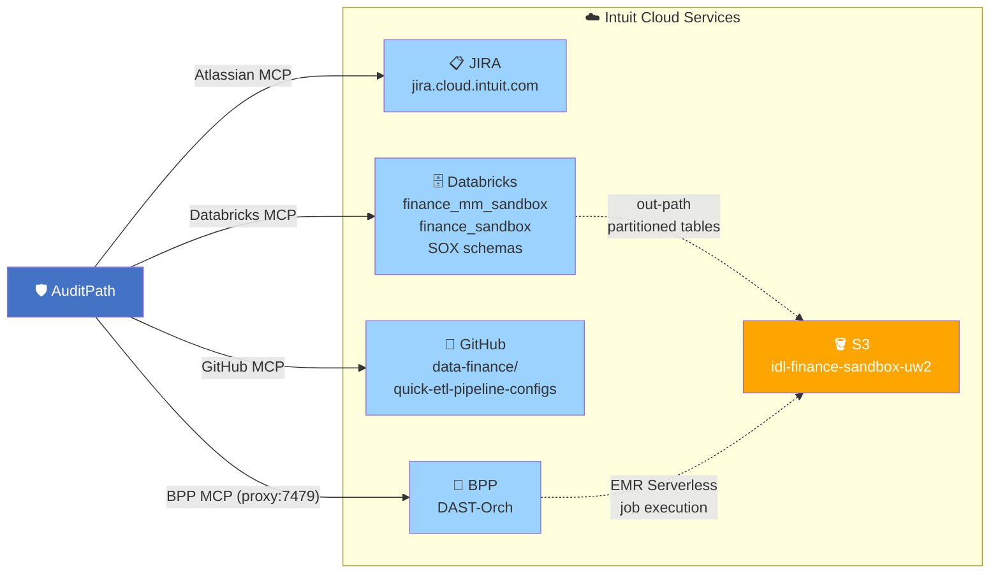
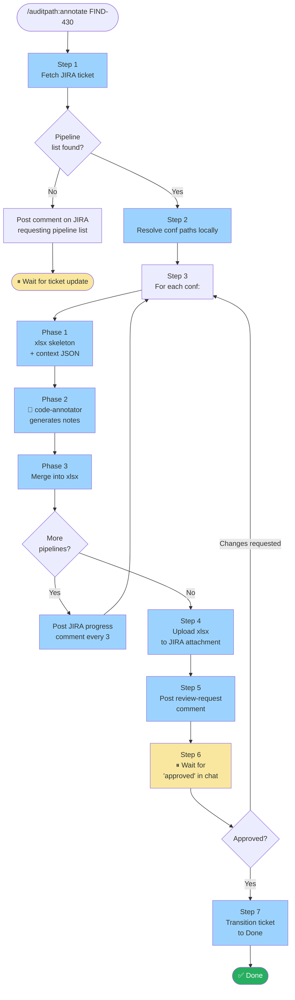
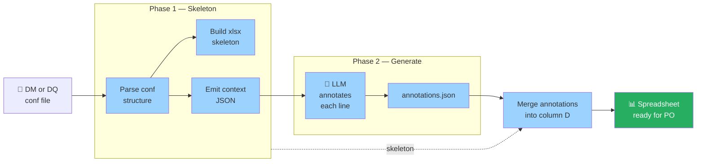
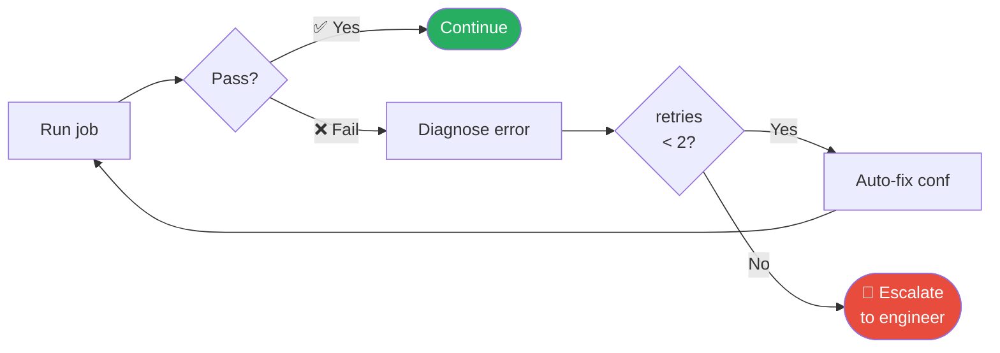
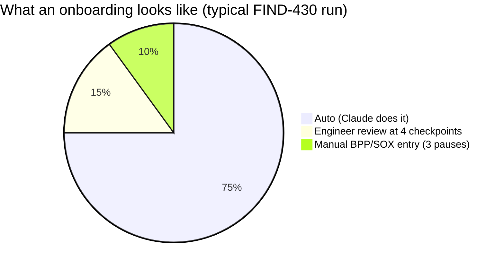

<div align="center">

# 🛡️ AuditPath

### End-to-End SOX Pipeline Onboarding Agent for QuickETL

*One JIRA ticket in. Production-ready, SOX-compliant DM + DQ pipeline out.*

[](#-development-status)
[](#-development-status)
[](#-the-14-phase-flow)
[](#-key-design-decisions)

[**Quick Start**](#-quick-start) • [**14-Phase Flow**](#-the-14-phase-flow) • [**Demo**](#-demo-a-pipeline-end-to-end) • [**Agents**](#-agent-roster--architecture) • [**Annotation**](#-standalone-code-annotation) • [**Troubleshooting**](#-troubleshooting)

</div>

---

## 📦 What it does

AuditPath is a Claude Code plugin that drives the complete lifecycle of onboarding a new ETL pipeline into the SOX Data Quality (DQ) framework — **from a JIRA ticket all the way to a SOX-compliant production pipeline with auditor-ready code review documentation.**

It is **domain-agnostic**: built for QBC today, it works unchanged for Loss Reserve, Capital, or any future domain.



---

## 🚀 Two Slash Commands

<table>
<tr>
<td width="50%" valign="top">

### `/auditpath:onboard <JIRA-KEY>`

**Full 14-phase onboarding workflow.**

One command turns a JIRA ticket into a production-ready, SOX-compliant pipeline with:
- ✅ DM QuickETL conf (multi-table CDC, partition-aware)
- ✅ 16-step SOX DQ conf
- ✅ BPP pipeline registration
- ✅ Unit tests passing
- ✅ Completeness + accuracy validation
- ✅ PR opened, JIRA closed
- ✅ Code review annotation spreadsheet

</td>
<td width="50%" valign="top">

### `/auditpath:annotate <JIRA-KEY>`

**JIRA-driven batch code-review annotation.**

Reads the pipeline list from a JIRA ticket and annotates every conf:
- ✅ All inputs sourced from JIRA — pipeline list, repo path, output file
- ✅ One xlsx with one sheet per pipeline
- ✅ Heavy-style business notes (resolved aliases + CTE cross-refs)
- ✅ Auto-uploads xlsx to JIRA + posts review-request comment
- ✅ Closes the ticket after customer approval

</td>
</tr>
</table>

---

## 🎯 Why this exists

| Without AuditPath | With AuditPath |
|-------------------|---------------|
| 5-10 days per pipeline | **Hours, not days** |
| Manual JIRA template entry | Auto-extracted from ticket |
| Source SQL trial-and-error | Live Databricks introspection + prototype SQL |
| Hand-written DM + DQ confs | Adaptive few-shot from QBC reference library |
| Schema-mismatch surprises at runtime | Schema enforced at intake (`SHOW SCHEMAS` filter) |
| `key not found: 0` Spark errors | Hardcoded non-negotiable settings + auto-fix loop |
| PO/SOX review = weeks of back-and-forth | Auditor-ready annotation spreadsheet, line-by-line |
| Inconsistent results across engineers | Same workflow, every pipeline, every domain |

---

## 🎬 Demo: A Pipeline End-to-End

A typical onboarding session looks like this:



---

## 🛠️ Installation

### Prerequisites

- Claude Code CLI installed (`claude --version`)
- Access to `data-finance/quick-etl-pipeline-configs` on GitHub Intuit
- All 4 required MCP servers connected (see [MCP Setup](#mcp-setup) below)
- BPP MCP proxy installed and running on `localhost:7479` before each Claude session (see [BPP MCP — manual setup required](#bpp-mcp--manual-setup-required-not-auto-configured))

### Step-by-step install

**1. Clone or pull the repo and check out the feature branch:**
```bash
git clone https://github.intuit.com/data-finance/quick-etl-pipeline-configs.git
cd quick-etl-pipeline-configs
git checkout feature/FIND-430-auditpath
```

If you already have the repo cloned:
```bash
cd quick-etl-pipeline-configs
git fetch origin
git checkout feature/FIND-430-auditpath
git pull origin feature/FIND-430-auditpath
```

**2. Register the repo as a local marketplace:**
```bash
claude plugin marketplace add /path/to/quick-etl-pipeline-configs
```
Replace `/path/to/` with the actual path on your machine. Example:
```bash
claude plugin marketplace add /Users/your-username/Intuit/git/quick-etl-pipeline-configs
```
Expected output:
```
Successfully added marketplace: intuit-de-plugins (declared in user settings)
```

**3. Install the plugin:**
```bash
claude plugin install auditpath
```
Expected output:
```
Successfully installed plugin: auditpath@intuit-de-plugins (scope: user)
```

**4. Verify the install:**
```bash
claude plugin list
```
Expected output:
```
Installed plugins:

  > auditpath@intuit-de-plugins
    Version: 0.1.0
    Scope: user
    Status: enabled
```

**5. Start the BPP proxy (required before every Claude session):**
```bash
eiamCli login                                    # browser auth, lasts ~10 hours — skip if already logged in
cd ~/Intuit/git/bpp-mcp/scripts/mcp-proxy
./start_proxy.sh                                 # starts the proxy on localhost:7479 (keep this terminal open)
curl http://localhost:7479/health                # verify: "ticket_valid": true
```

> **Why:** The BPP MCP (`localhost:7479`) is only available if the proxy is running **before** Claude starts. If you start Claude first and then start the proxy, the BPP tools won't be loaded and the agent will be unable to trigger or poll pipeline runs. If this happens, stop Claude, start the proxy, and restart Claude — the session will resume automatically from where it left off via the state file.

**6. Start Claude and run:**
```bash
cd /path/to/quick-etl-pipeline-configs
claude
```
Then in the Claude session:
```
/auditpath:onboard FIND-XXX
```

### Quick install (one command)

For new engineers — clone the repo and run the bundled installer once:

```bash
git clone https://github.intuit.com/data-finance/quick-etl-pipeline-configs.git
cd quick-etl-pipeline-configs
git checkout feature/FIND-430-auditpath
bash auditpath/install.sh
```

The installer:
- Registers `intuit-de-plugins` as a local marketplace in `~/.claude/settings.json`
- Creates symlinks from `~/.claude/auditpath-marketplace/auditpath/` to the git repo
- Enables `auditpath@intuit-de-plugins` for auto-load (`enabledPlugins` flag in settings.json)
- Makes `generate_annotation.py` executable
- Checks for the only Python dependency (`openpyxl`)

After this runs once, **every new `claude` session auto-loads the plugin** — no per-session setup, no slash-command registration, no path tweaking. `/auditpath:annotate` and `/auditpath:onboard` are available immediately.

### Auto-load — how it works

Plugins listed under `enabledPlugins` in `~/.claude/settings.json` are loaded on every session start:

```json
{
  "extraKnownMarketplaces": {
    "intuit-de-plugins": {
      "source": { "source": "directory", "path": "/Users/<you>/.claude/auditpath-marketplace" }
    }
  },
  "enabledPlugins": {
    "auditpath@intuit-de-plugins": true
  }
}
```

This is the configuration both the manual install steps and the `install.sh` script set up. Once present, you do not need to enable, install, or load the plugin again — it just works on every `claude` invocation.

**Verify auto-load is working:**
```bash
claude plugin list          # should show "auditpath@intuit-de-plugins ✔ enabled"
claude                       # launch session
# Inside Claude, type "/" — /auditpath:annotate and /auditpath:onboard should appear
```

### Updating to the latest version

When the plugin is updated on the branch, the symlinks point at the git repo so a `git pull` is enough:

```bash
cd quick-etl-pipeline-configs
git pull origin feature/FIND-430-auditpath
# No `claude plugin update` needed — symlinks make changes live immediately
```

If you originally installed via `claude plugin install` (which copies files instead of symlinking), use:
```bash
claude plugin update auditpath
```

### Uninstalling

```bash
claude plugin uninstall auditpath
```
This disables the plugin and removes it from `enabledPlugins`. To also delete the marketplace registration and symlinks:
```bash
rm -rf ~/.claude/auditpath-marketplace
# Then edit ~/.claude/settings.json to remove the "intuit-de-plugins" entry
```

---

## 🔌 MCP Setup

AuditPath requires 4 MCP servers. **The orchestrator auto-configures them on first run** — you only need to provide credentials once.

| MCP server key | Purpose | Phases used |
|----------------|---------|-------------|
| `confluence-intuit` | JIRA read/write (Atlassian MCP) | 1, 13 |
| `databricks` | Schema introspection + SQL execution | 2, 5, 6, 8 |
| `github-intuit` | Source SQL fetch + conf write + PR creation | 3, 8, 12 |
| `bpp-mcp` | Pipeline execution + status polling | 4, 5, 9, 10 |

### Integration map



### Auto-setup (what happens on first `/auditpath:onboard`)

When you run `/auditpath:onboard FIND-XXX` for the first time, the orchestrator:

1. Checks `~/.claude/settings.json` for each required MCP server
2. Auto-adds any missing server entries with the correct config
3. Checks that credentials are filled in for JIRA and GitHub
4. **Blocks with a clear message** if any credential is empty — lists exactly which field to fill and where

After filling in missing credentials, just restart Claude and re-run the command. No manual JSON editing required on subsequent runs.

### Credentials you must provide once

The auto-setup adds server config but cannot generate credentials for you. You need:

| Credential | Where to get it | Where it goes in `settings.json` |
|-----------|----------------|----------------------------------|
| JIRA API token | [Atlassian API tokens](https://id.atlassian.com/manage-profile/security/api-tokens) | `mcpServers.confluence-intuit.env.JIRA_API_TOKEN` |
| JIRA username | Your Intuit email (e.g. `you@intuit.com`) | `mcpServers.confluence-intuit.env.JIRA_USERNAME` |
| GitHub PAT | [GitHub Intuit tokens](https://github.intuit.com/settings/tokens) — `repo` scope | `mcpServers.github-intuit.env.GITHUB_PERSONAL_ACCESS_TOKEN` |
| Databricks profile | Pre-configured via `databricks auth login` — no token needed | Uses `DATABRICKS_CONFIG_PROFILE` |

### Prerequisites before first run

1. **Databricks CLI configured:**
   ```bash
   databricks auth login
   # Verify:
   databricks auth token --profile praveen_kurup@intuit.com
   ```

2. **`databricks-mcp-server` installed:**
   ```bash
   pip install databricks-mcp-server
   # Verify:
   ls ~/.local/bin/databricks-mcp-server
   ```

3. **Node.js / npx available** (for Atlassian + GitHub MCPs):
   ```bash
   node --version   # 18+
   npx --version
   ```

### BPP MCP — manual setup required (not auto-configured)

The BPP MCP uses a local auth proxy that must be started manually. The orchestrator auto-adds the `bpp-mcp` entry to `settings.json`, but you must start the proxy before each Claude session.

**One-time setup:**
```bash
git clone https://github.intuit.com/data-datalake/bpp-mcp.git ~/Intuit/git/bpp-mcp
cd ~/Intuit/git/bpp-mcp && git checkout develop
poetry env use python3.12 && poetry install
```

**Each session (before running `/auditpath:onboard`):**
```bash
eiamCli login                                    # browser auth, lasts 10 hours
cd ~/Intuit/git/bpp-mcp/scripts/mcp-proxy
./start_proxy.sh                                 # starts on localhost:7479
curl http://localhost:7479/health                # verify: ticket_valid: true
```

**BPP proxy troubleshooting:**

| Problem | Fix |
|---------|-----|
| `eiamCli command not found` | Install eiamCli and add to PATH |
| `Connection refused on :7479` | Start proxy with `./start_proxy.sh` |
| `ticket_valid: false` | Re-login: `eiamCli login`, restart proxy |
| `BPPUnauthorizedError` | Contact pipeline owner for access |

---

## ⚡ Quick Start

### New pipeline onboarding (full workflow)

```
/auditpath:onboard FIND-XXX
```

The agent reads the JIRA ticket, drives every phase autonomously, and pauses at defined checkpoints and manual steps for engineer input.

**Recommended first ticket:** Use a ticket that already has the full SOX DQ intake template filled in (DQ pipeline name + mandatory accuracy columns).

### Standalone code annotation (JIRA-driven)

```
/auditpath:annotate FIND-430
```

Reads a JIRA ticket that lists pipelines to annotate, generates a heavy-style line-by-line annotation spreadsheet for each, uploads the xlsx to the ticket, and closes the ticket after customer approval.

The ticket provides everything — pipeline list, git repo path, output file, developer name — so the command has no flags. Use this for bulk-annotation requests filed by the PO or auditor, or for retrofitting SOX annotations on a set of pipelines built before AuditPath.

The annotation is also automatically generated as Phase 14 of the full `/auditpath:onboard` workflow — running `/auditpath:annotate` standalone is only needed when annotation is requested as its own JIRA ticket (separate from a build).

See [Standalone Code Annotation](#standalone-code-annotation) below for full usage.

---

## ⏯️ Pause and Resume

You can stop an onboarding at any point — between phases, between checkpoints, or after a manual pause — and resume the next day or week without losing context.

### How it works

After every successful phase completion (and after every checkpoint approval), AuditPath writes the full session state to:

```
~/.claude/auditpath/state/<JIRA-KEY>.json
```

This file contains everything the agent needs to pick up where it left off: the JIRA key, table name, domain, target schema, write mode, CDC sources, partition decision, branch name, conf paths, BPP pipeline names, execution types, run IDs, fix-attempt counters, and the next phase to run.

### Resuming an onboarding

Just run the same command again:
```
/auditpath:onboard FIND-XXX
```

The agent's first action is to check for an existing state file. If one is found, it shows a resume prompt:

```
📂 Found prior session for FIND-430

  Last phase completed: 3 (DM Build)
  Status: paused
  Last updated: 2026-05-01T17:00:00-07:00
  Branch: FIND-430
  DM conf: configs/finance_mm_dm/qbc/qbc_loan_repayment_transaction.conf
  DM pipeline: qbc_loan_repayment_transaction

  [resume]   — Continue from Phase 4
  [restart]  — Discard saved state and start over from Phase 1
  [view]     — Show full saved state
```

- **`resume`** → jumps directly to the next phase. Skips JIRA re-fetch, source analysis, etc. unless that data is missing.
- **`restart`** → deletes the state file and starts Phase 1 normally.
- **`view`** → prints the full JSON, then re-asks.

### Manual editing

The state file is human-readable JSON. If you ever need to correct a value (e.g., the BPP pipeline name was mistyped, or you want to bump `current_phase` back one to redo a step), just edit the file directly:

```bash
$EDITOR ~/.claude/auditpath/state/FIND-430.json
```

### Resetting

To wipe state for one ticket:
```bash
rm ~/.claude/auditpath/state/FIND-430.json
```

To wipe all AuditPath state:
```bash
rm -rf ~/.claude/auditpath/state
```

---

## 📊 Standalone Code Annotation

The `/auditpath:annotate` command is **JIRA-driven** — it takes only a JIRA key and reads everything else (pipeline list, git path, output xlsx, developer) from the ticket. It annotates every listed pipeline, uploads the finished xlsx to JIRA, posts a review comment, and closes the ticket after customer approval.

### End-to-end flow



### Two-phase annotation engine (per pipeline)

Each conf file goes through the same two-phase pipeline:



### When to use

| Use case | Recommended |
|----------|-------------|
| New pipeline going through `/auditpath:onboard` | Phase 14 runs automatically — no separate ticket needed |
| Bulk annotation of all pipelines in a domain for a SOX audit cycle | File a JIRA ticket with the list, then `/auditpath:annotate <ticket>` |
| Retrofit annotation on existing pre-AuditPath pipelines | File a JIRA ticket with the list, then `/auditpath:annotate <ticket>` |
| Refresh annotations after conf changes | File a JIRA ticket with the affected confs, then `/auditpath:annotate <ticket>` |

### Invocation

```
/auditpath:annotate <JIRA-KEY>
```

That's the entire command line. **No flags.** Everything is read from the ticket.

### What the JIRA ticket must contain

The agent looks for a pipeline list in (in order):

1. A bullet list of `.conf` paths in the ticket **description**
2. A bullet list in any ticket **comment**
3. A linked **GitHub directory URL** — the agent lists all `.conf` files in that folder via the GitHub MCP

**Example ticket description:**

```markdown
## Pipelines to annotate
- configs/finance_mm_dm/loss_reserve/dim_money_profile.conf
- configs/finance_mm_dm/loss_reserve/fact_loss_reserve_ach_txn.conf
- configs/finance_mm_dm/loss_reserve/fact_loss_reserve_chargeoff_txn.conf

Local repo root: /Users/pkurup/Intuit/git/quick-etl-pipeline-configs
Output file: ~/Downloads/FIND-431_loss_reserve_annotations.xlsx
```

Or, using a GitHub folder URL (every `.conf` in the folder is annotated):

```markdown
GitHub folder: https://github.intuit.com/data-finance/quick-etl-pipeline-configs/tree/master/configs/finance_mm_dm/loss_reserve
```

**Optional fields** (the agent fills in defaults if absent):

| Field | Default |
|-------|---------|
| `Local repo root:` | `/Users/pkurup/Intuit/git/quick-etl-pipeline-configs` |
| `Output file:` | `~/Downloads/<jira_id>_Annotation.xlsx` |
| Developer name | JIRA assignee → reporter → `git config user.name` |

If the ticket has none of the above, the agent posts a structured comment on the ticket explaining exactly what to add, then stops.

### What it produces

A single xlsx with **one sheet per pipeline**, each using the standard reference template:

```
Row 1:    Title — "Code Reviewer | Purpose: Document understanding of code in meeting the business purpose"
Row 5-8:  Header — Developer / Date / Report Name / Brief Overview
Row 10+:  Identified Tables — every <schema>.<table> referenced in the conf
Row N+:   Annotation table — Line Number | Original code query | Developer Notes | PO Notes
            One row per conf line. Comments and blanks get "--", every other line gets a heavy-style note.
```

After all pipelines are annotated:

1. **Upload** — xlsx is attached to the JIRA ticket
2. **Review comment** — posted with a sheet-by-sheet summary table
3. **Wait for approval** in chat — `"approved"`, or `"changes requested: <which pipelines and what to fix>"` (max 2 revision rounds)
4. **Close ticket** — automatic transition to Done after approval

### Heavy-style annotation contract

Notes are written in business English, not code echo. Examples:

| Code | Note |
|------|------|
| `INNER JOIN ued_qbf_dwh.loan L ON L.id = ACH.loan_id` | `Connect tables "ACH" and [ued_qbf_dwh.loan], aliased as "L", only returning records if in both tables there is a match on id from "L" and loan_id from "ACH"` |
| `FULL OUTER JOIN dq_metadata ON true` | `Return all the rows from the results set above and [dq_metadata] (created in lines 57-78) combining every record from the results set above with every record in [dq_metadata] table.\n\nAdditionally, if either of the tables are empty, the records from the other table will still be returned.` |
| `WHERE col BETWEEN cast(NVL(START_DATE, '1900-01-01') AS DATE) AND cast(NVL(END_DATE, CURRENT_DATE()) AS DATE)` | `Only include records that match the conditions mentioned below:\n- col is on or after START_DATE (if this is null, then use '1900-01-01') and on or before END_DATE (if this is null, then use current date)` |

The full template library is in `agents/code-annotator.md`. Templates cover:

- HOCON sections, attributes, includes, brace closes
- SQL: SELECT (with derivations / casts / coalesce / concat / to_json / current_timestamp / row_number)
- SQL: FROM, every JOIN type (INNER / LEFT / FULL OUTER / CROSS), CTE references with line ranges
- SQL: WHERE / AND / OR / IN list / BETWEEN with NVL defaults / EXISTS / LIKE patterns / substring
- SQL: GROUP BY, ORDER BY, UNION ALL, sum/max/min aggregates
- SQL: WITH / CTE openers and closers
- SQL: CASE / WHEN / THEN / ELSE / END and IF expressions (including multi-line)
- SQL: INSERT INTO with PARTITION, INSERT OVERWRITE DIRECTORY
- Custom steps (SurrogateKeyGenerator, OptimizedMergeOperator, etc.)
- Spark properties block

### Two-phase script (bundled with the plugin)

> 📦 **Self-contained:** `generate_annotation.py` ships **inside the plugin** under `auditpath/scripts/`. Engineers who install `auditpath@intuit-de-plugins` get the script automatically — no separate downloads, no `pip install`, no path-discovery workarounds. The command and agent files resolve the script path through `${CLAUDE_PLUGIN_ROOT}` (with fallbacks to common installed locations) so runs work identically on every engineer's machine.

The agent uses `${CLAUDE_PLUGIN_ROOT}/scripts/generate_annotation.py` in two phases per pipeline:

```bash
# Phase 1: write skeleton xlsx + emit annotation_context.json (parsed conf + structural index)
python3 "$SCRIPT" skeleton \
  --xlsx <xlsx> --conf <conf> --sheet <name> \
  --developer "<name>" --report-name "<conf basename>" \
  --overview "<2-4 sentence summary inferred from conf>" \
  --context-out /tmp/<sheet>_context.json

# (code-annotator sub-agent reads the context, generates annotations.json with one note per line)

# Phase 2: merge the annotations into column D of the sheet
python3 "$SCRIPT" merge \
  --xlsx <xlsx> --sheet <name> \
  --annotations /tmp/<sheet>_annotations.json
```

(`$SCRIPT` is set by the path-resolution block at the start of `commands/annotate.md` — see [Step 0](#step-0--resolve-plugin-paths-do-this-first-before-anything-else) in the command file.)

The script also has a fallback `simple` mode for regex-based notes (NOT for SOX submission, only for build verification):

```bash
python3 "$SCRIPT" simple \
  --xlsx <xlsx> --conf <conf> --sheet <name> \
  --developer "<name>" --report-name "<basename>" --overview "<text>"
```

### Example end-to-end run

**JIRA ticket FIND-431:**
```
Title: Annotate all Loss Reserve DM pipelines for Q2 SOX audit

## Pipelines to annotate
GitHub folder: https://github.intuit.com/data-finance/quick-etl-pipeline-configs/tree/master/configs/finance_mm_dm/loss_reserve

Output file: ~/Downloads/FIND-431_Loss_Reserve_Annotation.xlsx
```

**Run it:**
```
/auditpath:annotate FIND-431
```

**What happens:**
1. Agent fetches the ticket, sees the GitHub folder URL, lists all 13 `.conf` files
2. For each conf: skeleton → code-annotator generates ~500 notes → merge
3. After every 3rd pipeline, posts a progress comment to FIND-431
4. After all 13 are done, uploads `FIND-431_Loss_Reserve_Annotation.xlsx` to the ticket
5. Posts a sheet-by-sheet review-request comment with line counts per pipeline
6. Waits for `"approved"` in chat
7. Transitions FIND-431 to Done with a final summary comment

### Limitations

- Multi-line SQL continuation lines (e.g., `transactionid STRING,` inside a CTAS column list, or the body of a multi-line CASE WHEN) may be flagged with `(SQL continuation)` prefix and need manual expansion during the code-walkthrough. The surrounding SQL is fully resolved with table/alias references and CTE line ranges, so the PO/Reviewer can use them as anchors.
- The agent does NOT modify the conf files
- The agent does NOT replace SOX review by the PO — the developer notes are starting points; the PO must still review and fill the PO Notes column
- If JIRA attachment upload fails (no API token, network error), the agent flags this in the review comment and provides the local xlsx path so the engineer can attach it manually

---

## 📐 Hard-coded Conventions

AuditPath enforces these rules on every onboarding. They are not configurable — they reflect the established AuditPath/SOX onboarding process.

| Rule | Value |
|------|-------|
| Target schema (DM table) | `finance_mm_sandbox` |
| SOX metadata schema | `finance_sandbox` (RPT_SOX_SETUP, RPT_SOX_METADATA) |
| DM conf folder | `configs/finance_mm_dm/<domain>/<table>.conf` |
| DQ conf folder | `configs/finance_mm_sox/<domain>/dq_<table>.conf` |
| Default write mode | `incremental` (full-refresh only when JIRA explicitly requires it, no CDC column exists on any source, or source is a snapshot table) |
| Multi-table CDC | Incremental window UNIONs changed primary keys from ALL contributing source tables — not just the primary |
| Source schemas | Only schemas containing `sox` in the name are valid sources. Non-SOX schemas are flagged for engineer approval before proceeding |
| Partition decision | Based ONLY on raw source SOX table row counts (`<10M` → no partition; `10M-100M` → date partition; `>100M` → date + optional categorical). Never inferred from existing Gold/DM tables, reference confs, or output volume |
| Primary key expression | Always URN format: `concat('urn:intuit:<domain>:<object>#', <pk_col>)` — never a bare column |
| Branch name | Exactly the JIRA key, no `feature/` prefix and no description suffix (e.g., `FIND-430`) |
| Parent branch | The domain's project branch (e.g., `origin/qbc`, `origin/loss-reserve`, `origin/capital`) — never `main`/`master` |
| Branch push | Pushed to remote immediately after the first commit (`git push -u origin <JIRA-KEY>`) |
| Validation window | Last closed calendar month (PST-aligned) for completeness and accuracy checks |
| Auto-fix retries | DM unit test: max 2 retries; DQ validation: max 2 retries; then escalate to engineer |

---

## 🔄 The 14-Phase Flow

AuditPath runs 14 phases in sequence:
- **4 Engineer Checkpoints** 🛑 — go/no-go gates that pause for review
- **3 Manual Pauses** ⏸️ — agent waits for the engineer to take an action outside Claude
- **2 Auto-Fix Loops** 🔁 — up to 2 retries for unit tests and SOX validation
- **1 Code Annotation** 📊 — auditor-ready spreadsheet at close-out

### High-level flow

```mermaid
flowchart TD
    Start([📋 JIRA Ticket]) --> P1
    P1[Phase 1<br/>JIRA Intake] --> P2[Phase 2<br/>Source Analysis]
    P2 --> CP1{🛑 CP1<br/>Source spec<br/>approved?}
    CP1 -->|Yes| P3[Phase 3<br/>DM Build]
    CP1 -->|Re-analyze| P2
    P3 --> P4[Phase 4 ⏸️<br/>DM BPP Registration]
    P4 --> P5[Phase 5<br/>DM Job Run]
    P5 --> P6[Phase 6<br/>Unit Test 🔁]
    P6 --> CP2{🛑 CP2<br/>DM build OK?}
    CP2 -->|Yes| P7[Phase 7 ⏸️<br/>SOX Metadata Entry]
    CP2 -->|Fix DM| P3
    P7 --> P8[Phase 8<br/>DQ Build]
    P8 --> P9[Phase 9 ⏸️<br/>DQ BPP Registration]
    P9 --> CP3{🛑 CP3<br/>DQ conf OK?}
    CP3 -->|Yes| P10[Phase 10<br/>DQ Job Run]
    CP3 -->|Fix DQ| P8
    P10 --> P11[Phase 11<br/>SOX Validation 🔁]
    P11 --> CP4{🛑 CP4<br/>Validation<br/>passed?}
    CP4 -->|Yes| P12[Phase 12<br/>PR Creation]
    CP4 -->|Fix DQ| P8
    P12 --> P13[Phase 13<br/>JIRA Close-out]
    P13 --> P14[📊 Phase 14<br/>Code Annotation]
    P14 --> Done([✅ Done])

    classDef phase fill:#4472C4,color:#fff,stroke:#305496,stroke-width:2px
    classDef pause fill:#FFA500,color:#fff,stroke:#E67E22,stroke-width:2px
    classDef checkpoint fill:#E74C3C,color:#fff,stroke:#C0392B,stroke-width:2px
    classDef terminal fill:#27AE60,color:#fff,stroke:#1E8449,stroke-width:2px
    class P1,P2,P3,P5,P6,P8,P10,P11,P12,P13,P14 phase
    class P4,P7,P9 pause
    class CP1,CP2,CP3,CP4 checkpoint
    class Start,Done terminal
```



### Phase summary table

| # | Phase | Driver | Type | Outcome |
|---|-------|--------|------|---------|
| 1 | **JIRA Intake** | `jira-intake` agent | Auto | Build spec extracted; ticket body updated |
| 2 | **Source Analysis** | `source-analyzer` agent | Auto | Schema enforced, prototype SQL run, grain/PK/CDC determined |
|   | **🛑 CP1 — Source Analysis Approval** | Engineer | Gate | Re-analyze unlimited rounds OR proceed |
| 3 | **DM Build** | `dm-builder` agent | Auto | Feature branch cut, DM conf written, committed |
| 4 | **DM BPP Registration ⏸️** | Engineer (manual) | Pause | DM pipeline registered in DAST-Orch UI |
| 5 | **DM Job Run** | Parent session (BPP MCP) | Auto | DM pipeline runs on sandbox |
| 6 | **Unit Test 🔁** | `unit-tester` agent | Auto + 2 retries | COUNT match + JOIN completeness + MINUS column diff |
|   | **🛑 CP2 — DM Build Review** | Engineer | Gate | Approve or request changes |
| 7 | **SOX Metadata Entry ⏸️** | Engineer (manual) | Pause | `RPT_SOX_SETUP` + `RPT_SOX_METADATA` inserted; JIRA updated |
| 8 | **DQ Build** | `dq-builder` agent | Auto | 16-step SOX DQ conf written, committed |
| 9 | **DQ BPP Registration ⏸️** | Engineer (manual) | Pause | DQ pipeline registered in DAST-Orch UI |
|   | **🛑 CP3 — DQ Conf Review** | Engineer | Gate | Approve or request changes |
| 10 | **DQ Job Run** | Parent session (BPP MCP) | Auto | DQ pipeline runs on sandbox |
| 11 | **SOX Validation 🔁** | `dq-validator` agent | Auto + 2 retries | Completeness + accuracy + late-arriving analysis |
|   | **🛑 CP4 — Validation Results** | Engineer | Gate | Approve close-out |
| 12 | **PR Creation** | Parent session (GitHub MCP) | Auto | PR opened on the feature branch |
| 13 | **JIRA Close-out** | `jira-updater` agent | Auto | Final results comment posted; ticket transitioned |
| 14 | **Code Annotation 📊** | `code-annotator` agent | Auto (skippable) | Heavy-style SOX review spreadsheet generated |

> 💡 **Phases 5 and 10 (BPP execution)** run inline in the parent session, NOT in the `bpp-runner` sub-agent. Sub-agents cannot reliably load deferred BPP MCP tools via `ToolSearch`. The parent session calls `execute_pipeline`, `get_pipeline_execution_history`, `get_execution_details`, and `debug_emr_pipeline_jobs` directly.
>
> 💡 **Phase 14** is non-gated — the engineer can skip it if the conf doesn't need a SOX review spreadsheet, or file a separate JIRA annotation ticket later and run `/auditpath:annotate <JIRA-KEY>`.

---

## 🤖 Agent Roster & Architecture

### Parent-session-driven architecture

Sub-agents in Claude Code cannot use `ToolSearch` to load deferred MCP tools, so AuditPath uses a **parent-session-driven model**: the parent session is the MCP gateway, and sub-agents are file/analysis workers that receive pre-fetched data as input.

```mermaid
graph TB
    subgraph Parent["🎯 Parent Session (the /auditpath:onboard runner)"]
        P[Workflow Driver]
        MCP1[Atlassian MCP]
        MCP2[Databricks MCP]
        MCP3[GitHub MCP]
        MCP4[BPP MCP]
        P --- MCP1
        P --- MCP2
        P --- MCP3
        P --- MCP4
    end

    subgraph Subs["🛠️ Sub-Agents (file & analysis workers)"]
        S1[jira-intake]
        S2[source-analyzer]
        S3[dm-builder]
        S4[bpp-registrar]
        S5[unit-tester]
        S6[dq-builder]
        S7[dq-validator]
        S8[jira-updater]
        S9[code-annotator]
    end

    P -->|"pre-fetched JIRA"| S1
    P -->|"pre-fetched schemas + counts"| S2
    P -->|"analysis report"| S3
    P -->|"DM/DQ details"| S4
    P -->|"DM run results"| S5
    P -->|"setup_id + accuracy_cols"| S6
    P -->|"completeness + accuracy"| S7
    P -->|"final results"| S8
    P -->|"conf path + overview"| S9

    classDef parent fill:#4472C4,color:#fff
    classDef sub fill:#9CD3FE,color:#000
    classDef mcp fill:#FFA500,color:#fff
    class P parent
    class MCP1,MCP2,MCP3,MCP4 mcp
    class S1,S2,S3,S4,S5,S6,S7,S8,S9 sub
```



### Roster

| Agent | Model | Phase(s) | What it does |
|-------|-------|----------|--------------|
| 🎯 **Parent session** | inline | All | Drives the 14-phase workflow; gateway for all MCP calls |
| `jira-intake` | Sonnet | 1 | Reads JIRA ticket; extracts build spec; updates ticket body with intake template |
| `source-analyzer` | Sonnet | 2 | Enforces SOX schema; identifies source columns; builds & executes prototype SQL; determines grain, PK, write mode, partition strategy |
| `dm-builder` | Opus | 3 | Generates DM QETL conf using QBC reference library; classifies CTE complexity; multi-table CDC; partition-aware |
| `bpp-registrar` | Sonnet | 4, 9 | Provides BPP registration details to engineer; waits for confirmation; verifies via BPP MCP |
| `unit-tester` | Sonnet | 6 | Runs COUNT match + JOIN completeness + MINUS column diff against last closed month; auto-fix loop (max 2 retries) |
| `dq-builder` | Opus | 8 | Reads DQ pipeline name + accuracy columns from JIRA; verifies SOX metadata; generates 16-step SOX DQ conf |
| `dq-validator` | Sonnet | 11 | Queries `rpt_sox_completeness` + `rpt_sox_accuracy`; late-arriving data analysis; auto-fix loop (max 2 retries) |
| `jira-updater` | Sonnet | 13 | Posts structured results comment to JIRA; creates PR; transitions ticket to Done |
| `code-annotator` | Sonnet | 14 | Generates heavy-style SOX code-review annotation spreadsheet — one note per conf line, with resolved aliases and CTE cross-references |
| `orchestrator` | Opus | — | ⚠️ Legacy — not invoked. Parent session drives workflow inline |
| `bpp-runner` | Sonnet | — | ⚠️ Legacy — Phases 5 & 10 run inline in parent session |

### 🔁 Auto-fix loops

Two phases support automatic retry on failure, max 2 retries before escalating to the engineer:



| Loop | Trigger | Fix mode |
|------|---------|----------|
| **Phase 6 — DM Unit Test** | Row count mismatch, JOIN drop, or column-level MINUS diff | Re-invoke `dm-builder` with diagnostic + diff; re-register? no; re-run DM job |
| **Phase 11 — SOX Validation** | `matched=0` on completeness, accuracy mismatch, or 16-step DQ conf error | Re-invoke `dq-builder` with column-diff + error log; re-run DQ job |

---

## 🛑 Four Engineer Checkpoints

### CP1 — Source Analysis Go / No-Go (after Phase 2)
Engineer reviews the full source analysis report before any conf files are generated. This is a hard gate — the agent does not proceed until the engineer approves or provides feedback for re-analysis. Re-analysis rounds are unlimited.

```
Review includes:
  - Confirmed SOX source schemas and tables
  - Column mapping (JIRA attribute → source column)
  - Prototype SQL results (LIMIT 100, executed live)
  - Grain statement + PK expression
  - Write mode determination (full_refresh / incremental)
  - Volume + partition recommendation (based on live COUNT)
  - Open items requiring engineer clarification

Options: [approve] [request re-analysis with feedback] [stop]
```

### CP2 — DM Build Review (after Phase 6)
Engineer reviews the generated DM conf and unit test results before SOX metadata entry begins.

```
Review includes:
  - DM conf diff (git diff inline)
  - Unit test results: COUNT match, JOIN completeness, MINUS delta
  - Any auto-fix attempts made during unit testing

Options: [approve] [request changes] [stop]
```

### CP3 — DQ Conf Review (after Phase 9 / DQ BPP Registration)
Engineer reviews the generated 16-step SOX DQ conf before the DQ pipeline is executed.

```
Review includes:
  - DQ conf diff (git diff inline)
  - Verified rpt_sox_setup + rpt_sox_metadata entries
  - DQ pipeline name (camelCase, max 27 chars)
  - Non-negotiable settings verification: cache-results, timezone, autoBroadcastJoinThreshold

Options: [approve] [request changes] [stop]
```

### CP4 — Validation Results (after Phase 11)
Engineer reviews SOX completeness and accuracy results before the ticket is closed.

```
Review includes:
  - Completeness: source count vs target count, delta, status
  - Accuracy: matched/total samples, mismatched columns (if any)
  - Late-arriving data analysis (if delta > 0)
  - Verdict: PASS / PASS with tolerance / FAIL
  - Any auto-fix attempts made during validation

Options: [approve close-out] [investigate further] [stop]
```

---

## ⏸️ Three Manual Engineer Pauses

### Pause 1 — DM BPP Registration (Phase 4, between DM Build and DM Job Run)
The agent cannot register a pipeline in BPP — that is a one-time manual action. The `bpp-registrar` agent provides all the details the engineer needs:
- Suggested pipeline name
- Conf file path and branch
- Recommended execution type (EMR_SERVERLESS < 50M rows; EMR_EC2 ≥ 50M rows or partitioned)

The engineer creates the pipeline in BPP and reports back with the confirmed pipeline name and execution type. The agent stores these in session context and never asks again.

### Pause 2 — SOX Metadata Entry (Phase 7, between CP2 and DQ Build)
The engineer manually inserts two database records:
1. `rpt_sox_setup` — target table registration with date window and ACTIVE_FLAG
2. `rpt_sox_metadata` — one row per mandatory accuracy column

The engineer then updates the JIRA ticket with the DQ pipeline name and mandatory accuracy columns table. The `dq-builder` agent verifies these entries exist via SELECT queries before building the DQ conf.

### Pause 3 — DQ BPP Registration (Phase 9, between DQ Build and CP3)
Same pattern as Pause 1, for the DQ pipeline. The `bpp-registrar` agent provides registration details; engineer creates the pipeline in BPP; agent stores and reuses for any autonomous retries.

---

## 💡 Key Design Decisions

### SOX Schema Enforcement
Only Databricks schemas with `sox` in the schema name are valid sources for SOX pipelines. The `source-analyzer` agent runs `SHOW SCHEMAS` and filters to `*sox*` schemas. Non-SOX schemas are flagged and cannot be used without engineer override.

### Scratch-Based Source Analysis (No Reference Dependency)
Source analysis works from JIRA requirements and live Databricks introspection — not from a reference pipeline. A similar existing conf is discovered opportunistically as a bonus for dm-builder, but the analysis does not depend on it.

### Prototype SQL Execution
Before any conf is generated, `source-analyzer` builds and executes a prototype SQL (LIMIT 100) against the actual SOX source tables via Databricks MCP. Joins are validated live — not assumed.

### QBC Reference Conf Library (dm-builder)
dm-builder selects the closest reference conf based on write mode and partition need:

| Scenario | Reference conf |
|----------|----------------|
| Full refresh, no partition | `qbc_loanpro_loan_hardship.conf` |
| Incremental, no partition | `qbc_loanpro_borrower.conf` |
| Incremental, with partition | `qbc_loanpro_loan_forecast_daily.conf` |
| Full refresh, with partition | `qbc_loanpro_loan_forecast_daily.conf` |

### CTE Complexity Tiers (dm-builder + unit-tester + dq-builder)
CTE chains are classified by volume and count before any conf is generated:

| Tier | Criteria | Strategy |
|------|----------|----------|
| Simple | < 1M rows, single CTE | Single in-memory step |
| Moderate | 1M–10M rows, multi-CTE | Multi-step in-memory |
| Complex | > 10M rows or > 15 CTEs | S3 intermediate saves at 5M row threshold |

The **> 15 CTE rule** is a hard rule across all agents: unit-tester and dq-builder always read from the S3 intermediate materialized by dm-builder rather than re-running the full inline chain.

### Unit Test Window Scoping
All three unit test checks are scoped to the **last closed calendar month** to keep execution time and data volume bounded:
- **COUNT check**: source vs target row count within the window
- **JOIN check**: both sides windowed before joining (prevents OOM)
- **MINUS check**: source columns vs target columns within the window

### BPP Runner Mode Awareness
`bpp-runner` operates in two modes:
- `first_run`: shows full confirmation prompt and waits for engineer approval before executing
- `retry`: executes immediately using pipeline details stored in session context from registration — no re-confirmation needed

Pipeline names are locked in session context at registration time and never change.

### DQ Pipeline Naming Convention
- Format: **camelCase** with `dq` prefix
- Maximum length: **27 characters** (hard limit — BPP constraint)
- Example: `dqQbcLpLoanRepaymentTrans` (25 chars ✅)
- Name comes from JIRA ticket — never derived independently by the agent

### Metadata Ownership
The engineer owns `rpt_sox_setup` and `rpt_sox_metadata` — the agent never generates or executes INSERT SQL for these tables. `dq-builder` only verifies entries exist and are correct via SELECT queries.

### Missing JIRA Information — Pause and Wait
If any required field is missing from the JIRA ticket at any phase, the agent stops immediately, lists every missing field with the reason it is needed, and waits for the engineer to update the ticket and confirm. The agent never infers, defaults, or guesses missing values.

### Auto-Fix Loops
Two agents have autonomous fix-and-retry capability (max 2 retries each):
- **unit-tester**: diagnoses delta → fixes DM conf → re-runs DM pipeline → re-tests
- **dq-validator**: diagnoses mismatch → fixes DQ conf → re-runs DQ pipeline → re-validates

After 2 failed retries, both agents escalate to the engineer with a full diagnostic report.

### Non-Negotiable DQ Conf Settings
Every generated DQ conf must have these settings — `dq-builder` self-verifies before returning:

| Setting | Value | Reason |
|---------|-------|--------|
| `cache-results` | `true` | Required for SurrogateKeyGenerator temp view access |
| `spark.sql.session.timeZone` | `America/Los_Angeles` | Aligns `current_date()` with DM PST cutoff |
| `spark.sql.autoBroadcastJoinThreshold` | `-1` | Prevents Cartesian OOM on large joins |
| `dq_metadata` references | Scalar subqueries | No CROSS JOIN — avoids row explosion |
| Date window | `last_day()` pattern | Eliminates trailing-day lag vs T-2 |

---

## 💾 Session Context

The orchestrator maintains a session context object throughout the run. Key fields:

```json
{
  "jira_id": "FIND-XXX",
  "table_name": "fact_...",
  "domain": "QBC | LOSS_RESERVE | CAPITAL",
  "target_schema": "finance_mm_dm",
  "sox_source_schemas": ["..."],
  "grain": "one row per ...",
  "pk_expression": "concat('urn:intuit:...')",
  "write_mode": "full_refresh | incremental",
  "partition_needed": "yes | no",
  "recommended_partition": "...",
  "branch": "feature/FIND-XXX-...",
  "dm_conf_path": "configs/finance_mm_dm/...",
  "dm_pipeline_name": "...",
  "dm_execution_type": "EMR_SERVERLESS | EMR_EC2",
  "dm_intermediate_s3_path": "s3://... (if complex CTE)",
  "dq_conf_path": "configs/finance_mm_sox/...",
  "dq_pipeline_name": "dqXxx...",
  "dq_execution_type": "EMR_SERVERLESS | EMR_EC2",
  "setup_id": 123,
  "validation_result": "PASS | PASS_WITH_TOLERANCE | FAIL",
  "dm_fix_attempts": 0,
  "dq_fix_attempts": 0,
  "analysis_rounds": 1
}
```

---

## 🔗 Required MCPs

| MCP | Used by | Purpose |
|-----|---------|---------|
| JIRA MCP | jira-intake, jira-updater, dq-builder | Read/write JIRA tickets and comments |
| Databricks MCP | source-analyzer, dq-builder, unit-tester, dq-validator | Schema introspection, SQL execution, validation queries |
| GitHub MCP (intuit-github-mcp) | jira-intake, source-analyzer, dm-builder, dq-builder, jira-updater | Source SQL fetch, conf file write, PR creation |
| BPP MCP (`data-datalake/bpp-mcp`) | bpp-registrar, bpp-runner | Pipeline execution, status polling, failure debugging |

See [MCP Setup](#mcp-setup) for detailed installation instructions for each server.

---

## 📁 Plugin File Structure

```
auditpath/
├── README.md                          ← this file
├── plugin.json                        ← plugin metadata
├── commands/
│   ├── onboard.md                     ← /auditpath:onboard FIND-XXX (full 14-phase workflow)
│   ├── annotate.md                    ← /auditpath:annotate <JIRA-KEY> (JIRA-driven standalone)
│   └── setup.md                       ← /auditpath:setup (one-time MCP/permissions setup)
├── agents/
│   ├── orchestrator.md                ← legacy — not invoked (see Architecture Note)
│   ├── jira-intake.md                 ← Phase 1
│   ├── source-analyzer.md             ← Phase 2
│   ├── dm-builder.md                  ← Phase 3
│   ├── bpp-registrar.md               ← Phases 4 + 9 (DM + DQ pipeline registration)
│   ├── bpp-runner.md                  ← legacy — Phases 5 + 10 run inline in parent session
│   ├── unit-tester.md                 ← Phase 6
│   ├── dq-builder.md                  ← Phase 8
│   ├── dq-validator.md                ← Phase 11 (SOX completeness + accuracy)
│   ├── jira-updater.md                ← Phase 13
│   ├── code-annotator.md              ← Phase 14 (and /auditpath:annotate standalone)
│   ├── setup.md                       ← one-time MCP/permissions configuration
│   └── validator.md                   ← (legacy — superseded by dq-validator)
├── scripts/
│   └── generate_annotation.py         ← skeleton + merge engine for code-annotator
└── skills/
    └── sox-pipeline-ref/
        ├── SKILL.md
        ├── refs/
        │   ├── dm-patterns.md          ← Write modes, HOCON skeletons, class names
        │   ├── sox-dq-patterns.md      ← 16-step DQ pattern + all SQL templates
        │   ├── guardrails.md           ← Approval policy, non-negotiables
        │   └── validation-queries.md   ← Completeness + accuracy + late-arriving SQL
        └── templates/
            ├── sox-setup-insert.sql    ← rpt_sox_setup + rpt_sox_metadata reference
            └── jira-comment-format.md  ← Structured progress + results comment format
```

---

## 🛡️ Guardrails Summary

| Action | Ask First? | Notes |
|--------|-----------|-------|
| DESCRIBE / SELECT / COUNT | No | Read-only |
| Search GitHub / read confs | No | Read-only |
| Execute prototype SQL (LIMIT 100) | No | Read-only, validation only |
| Generate conf files | No | Reversible via `git restore` |
| git commit + push | **Always** | With JIRA ID in commit message |
| BPP pipeline execution (first run) | **Always** | State environment clearly |
| BPP pipeline execution (retry) | No | Autonomous — pipeline confirmed at registration |
| rpt_sox_setup / rpt_sox_metadata INSERT | **Never** | Engineer does this manually |
| JIRA progress comment | No | Informational only |
| JIRA results comment | **Always** | Final record — confirmed at CP4 |
| JIRA ticket transition | **Always** | Explicit status change |
| PR creation | **Always** | Triggers review notifications |
| Auto-fix loop (unit test or DQ) | No (≤ 2 retries) | Autonomous; each attempt reported |

---

## 🔧 Troubleshooting

| Problem | Fix |
|---------|-----|
| `/auditpath:onboard` not visible in `/` list | Restart Claude after install; verify `claude plugin list` shows status enabled |
| **`Unknown command: /auditpath:onboard`** after switching git branches | See [Plugin disappears after git branch switch](#plugin-disappears-after-git-branch-switch) below |
| `Plugin not found in any configured marketplace` | Run `claude plugin marketplace add <repo-path>` first, then `claude plugin install auditpath` |
| MCP connection error at startup | Check that all 4 MCPs are configured in `~/.claude/settings.json` — see [MCP Setup](#mcp-setup) |
| `BPP MCP missing` | Start the BPP auth proxy (`./start_proxy.sh`) and verify health at `http://localhost:7479/health` |
| BPP proxy `ticket_valid: false` | Re-login with `eiamCli login`, then restart the proxy |
| `poetry install` fails with timeout | Retry — transient network issue with `artifact.intuit.com`; ensure VPN is connected |
| GitHub MCP `Resource not found` | Verify your PAT has `repo` scope and `GITHUB_API_URL` is set to `https://github.intuit.com/api/v3` |
| JIRA MCP `401 Unauthorized` | Re-authenticate via `jira_set_auth` with a fresh API token |

### Plugin disappears after git branch switch

**Root cause:** If the marketplace was registered pointing directly at the git repo directory (e.g., `/Users/you/git/quick-etl-pipeline-configs`), then when the repo is on a feature branch like `FIND-430` (cut from `origin/qbc`), the plugin files don't exist on that branch — so Claude can't find the plugin and `/auditpath:onboard` stops working.

**The fix:** The marketplace must point at a **stable directory outside the repo** that always has the plugin files, regardless of which branch the repo is on. The canonical location is `~/.claude/auditpath-marketplace/`.

**One-time setup (run once after cloning):**

```bash
# 1. Create the stable marketplace directory
mkdir -p ~/.claude/auditpath-marketplace/.claude-plugin
mkdir -p ~/.claude/auditpath-marketplace/auditpath

# 2. Write the marketplace manifest
cat > ~/.claude/auditpath-marketplace/.claude-plugin/marketplace.json << 'EOF'
{
  "name": "intuit-de-plugins",
  "description": "Intuit Data Engineering plugins (local cache-backed marketplace for AuditPath)",
  "owner": {
    "name": "Your Name",
    "email": "your_email@intuit.com"
  },
  "plugins": [
    {
      "name": "auditpath",
      "source": "./auditpath",
      "description": "End-to-end SOX pipeline onboarding plugin"
    }
  ]
}
EOF

# 3. Symlink the plugin source to the Claude plugin cache
#    (the cache is populated when you first install the plugin from the repo branch)
CACHE=~/.claude/plugins/cache/intuit-de-plugins/auditpath/0.1.0
ln -sf "$CACHE/agents"     ~/.claude/auditpath-marketplace/auditpath/agents
ln -sf "$CACHE/commands"   ~/.claude/auditpath-marketplace/auditpath/commands
ln -sf "$CACHE/skills"     ~/.claude/auditpath-marketplace/auditpath/skills
ln -sf "$CACHE/.claude-plugin" ~/.claude/auditpath-marketplace/auditpath/.claude-plugin
ln -sf "$CACHE/README.md"  ~/.claude/auditpath-marketplace/auditpath/README.md

# 4. Verify: list the marketplace directory
ls -la ~/.claude/auditpath-marketplace/auditpath/
```

**Then update `~/.claude/settings.json`** — change the marketplace `path` from the repo to the stable directory:

```json
"extraKnownMarketplaces": {
  "intuit-de-plugins": {
    "source": {
      "source": "directory",
      "path": "/Users/your-username/.claude/auditpath-marketplace"
    }
  }
}
```

**Reinstall the plugin from the new location:**

```bash
claude plugin uninstall auditpath
claude plugin install auditpath
claude plugin list   # verify: status enabled
```

After this one-time setup, `/auditpath:onboard` works on **any branch** of the repo — you can freely switch to `FIND-430`, `origin/qbc`, `main`, or any other branch without losing the plugin.

**Why symlinks?** The symlinks point into Claude's own plugin cache (`~/.claude/plugins/cache/`), which is branch-independent. When you update the plugin (pull latest from the feature branch and reinstall), the cache is refreshed and the symlinks automatically point to the updated files.

---

## 📈 Development Status

| Agent | Status |
|-------|--------|
| orchestrator | ⚠️ Legacy — not invoked. Parent session drives the workflow inline (see Architecture Note) |
| jira-intake | ✅ Complete |
| source-analyzer | ✅ Complete (v3 — scratch-based, SOX schema enforcement, prototype SQL) |
| dm-builder | ✅ Complete (v3 — QBC reference library, CTE tiers, S3 intermediates, multi-table CDC, branch-from-domain) |
| bpp-registrar | ✅ Complete |
| bpp-runner | ⚠️ Legacy — Phases 5 + 10 run inline in parent session (sub-agents cannot reliably load deferred BPP MCP tools) |
| unit-tester | ✅ Complete (v2 — windowed checks, S3 intermediate support, auto-fix loop) |
| dq-builder | ✅ Complete (v3 — JIRA completeness check, metadata verification, 16-step gen) |
| dq-validator | ✅ Complete (v2 — readiness check, completeness + accuracy + late-arriving, column-diff) |
| jira-updater | ✅ Complete (v2 — 14-phase progress, 4 checkpoints, CP4 final report) |
| code-annotator | ✅ Complete (v1.1 — heavy-style SOX review spreadsheet, 2-phase script with skeleton + LLM-generated annotations + merge; JIRA-driven batch via `/auditpath:annotate <JIRA-KEY>` and Phase 14 of `/auditpath:onboard`) |

**Branch:** `FIND-478` (development) → merge to `qbc` → merge to `master` in `data-finance/quick-etl-pipeline-configs`

**Validated on:** FIND-430 / FIND-478 — `qbc_loanpro_loan_repayment_transaction` end-to-end (DM build, multi-table CDC, BPP registration, DM run, unit tests, SOX metadata, DQ build, DQ run, validation, code annotation).

**Future:** Move plugin to `claude-de-plugins` repo once end-to-end validation on a non-QBC domain (Loss Reserve / Capital) passes.

---

## 🎤 TL;DR for Demo

<table>
<tr>
<td width="33%" valign="top" align="center">

### 🚀
### One Command

```
/auditpath:onboard FIND-XXX
```

JIRA ticket → production pipeline.

</td>
<td width="33%" valign="top" align="center">

### 🧠
### 14 Phases

4 engineer gates.<br/>
3 manual pauses.<br/>
2 auto-fix loops.<br/>
1 audit spreadsheet.

</td>
<td width="33%" valign="top" align="center">

### 🌐
### Domain-Agnostic

QBC today.<br/>
Loss Reserve, Capital tomorrow.<br/>
No hardcoded domain logic.

</td>
</tr>
</table>



### Get started

| You want to... | Run this |
|----------------|----------|
| Onboard a brand-new pipeline | `/auditpath:onboard <JIRA-KEY>` |
| Annotate one or more existing confs for SOX review | File a JIRA ticket listing them, then `/auditpath:annotate <JIRA-KEY>` |
| Resume a paused onboarding | Same `/auditpath:onboard <JIRA-KEY>` — it auto-detects state |
| One-time setup of MCPs | `/auditpath:setup` |

---

<div align="center">

*Last updated: 2026-05-08 | AuditPath v0.1.1*

**Built by Praveen Kurup** • [praveen_kurup@intuit.com](mailto:praveen_kurup@intuit.com)

</div>
