# pii-minimization — Claude Code Plugin

End-to-end IDPS encryption rollout for data pipeline schemas. Automates Phase 1 (decrypt-on-read) and Phase 2 (encrypt-on-write) across all pipeline frameworks, with Redshift column widening gate before Phase 2.

## Supported frameworks

| Framework | Agent | Phase 1 | Phase 2 |
|-----------|-------|---------|---------|
| RDA BPP (PySpark/EMR) | Alex | odin_decrypt in SQL SELECT | odin_encrypt in SQL SELECT |
| QuickETL (HOCON .conf) | Quinn | odin_decrypt in inline SQL | odin_encrypt in inline SQL |
| Quickbase (Aurora+QuickETL) | Quin | Create new encrypt jobs → PRF | Promote PRF jobs to PRD |
| SPP (Kafka) | Sam | N/A (single-phase) | odin_encrypt + immediate backfill |
| Report Requestor (Python) | Rio | odin_decrypt() injection | odin_encrypt() injection |
| Redshift widening | Rex | — | Hard gate before Phase 2 |

## Install

Run once per machine:

```bash
bash /path/to/claude-de-plugins/pii-minimization/install.sh
```

Or manually:

```bash
# 1. Add marketplace (local path or git URL)
claude plugin marketplace add ~/Documents/GitHub/claude-de-plugins

# 2. Install plugin
claude plugin install pii-minimization@intuit-de
```

## Required MCPs

Connect these before running any command:

| MCP | Purpose |
|-----|---------|
| `jira-mcp` | Read tickets, post comments, transition status |
| `DAST-Orch` | Execute BPP pipelines + GitHub operations |

## Usage

```bash
# Phase 1 — decrypt-on-read (just pass the Jira story)
/pii-minimization:phase1 FIND-773

# Phase 2 — encrypt-on-write (just pass the Jira story)
/pii-minimization:phase2 FIND-719

# Redshift column widening (gate before Phase 2)
/pii-minimization:redshift-widen FIND-699

# With explicit schema override (if story is ambiguous)
/pii-minimization:phase1 FIND-706 schema=risk_analytics_stable

# Quickbase — one table at a time
/pii-minimization:phase1 FIND-710 table=quickbase_sync_accounts
```

## How it works

```mermaid
flowchart TD
    DEV([Developer]) -->|"/pii-minimization:phase1 FIND-XXX"| CMD[phase1 / phase2 command\nOrchestrator]

    CMD --> INTAKE[intake agent\nReads Jira story]
    INTAKE -->|schema + pipeline type| DISPATCH{Dispatch by\npipeline type}

    DISPATCH -->|rda_bpp| ALEX[Alex\nRDA BPP Engineer]
    DISPATCH -->|quicketl| QUINN[Quinn\nQuickETL Engineer]
    DISPATCH -->|quickbase| QUIN[Quin\nQuickbase Engineer]
    DISPATCH -->|spp| SAM[Sam\nSPP Engineer]
    DISPATCH -->|report_requestor| RIO[Rio\nReport Requestor Engineer]
    DISPATCH -->|redshift-widen| REX[Rex\nRedshift DBA]

    %% RDA BPP flow
    ALEX -->|lookup SENSITIVE cols\ngid=1687383891| SHEET[(PII Inventory\nGoogle Sheet)]
    ALEX -->|invoke| DF1[data-forge plugin\ncode change + PR]
    DF1 -->|Checkpoint 1\nchange plan review| DEV
    DF1 --> SSA[Developer runs SSA\ndev test]
    SSA -->|S3 validation| ALEX
    ALEX -->|merge + PRD run| JIRA1[Jira → Done]

    %% QuickETL flow
    QUINN -->|lookup SENSITIVE cols| SHEET
    QUINN -->|invoke| DF2[data-forge plugin\ncode change + PR]
    DF2 -->|Checkpoint 1| DEV
    QUINN -->|PRF pipeline run\nAthena validation| CP2Q{Checkpoint 2}
    CP2Q -->|approve| QUINN
    QUINN -->|PRD pipeline run\nAthena validation| JIRA2[Jira → Done]

    %% Quickbase flow
    QUIN -->|lookup SENSITIVE cols| SHEET
    QUIN -->|create new QuickETL job\nPRF deploy + Athena validation| CP2QB{Checkpoint 2}
    CP2QB -->|approve| QUIN
    QUIN -->|Phase 2: PRD promote\nAthena validation| JIRA3[Jira → Done]

    %% SPP flow
    SAM -->|lookup SENSITIVE cols| SHEET
    SAM -->|invoke| DF3[data-forge plugin\ncode change + PR]
    DF3 -->|Checkpoint 1| DEV
    DEV -->|release Spark version\nupdate Data Pipeline| E2E[E2E test]
    E2E -->|ciphertext validated| SAM
    SAM -->|Phase 2: PRD Data Pipeline\nupdate + PRD validation| JIRA4[Jira → Done]

    %% Report Requestor flow
    RIO -->|lookup SENSITIVE cols| SHEET
    RIO -->|inject odin_decrypt/encrypt\nPR per script| ECDEV[Developer EC2\ndev test]
    ECDEV -->|Excel report comparison| RIO
    RIO --> JIRA5[Jira → Done]

    %% Redshift flow
    REX -->|audit VARCHAR lengths\ngenerate ALTER DDL| STAGING[Staging dry-run\nCOPY validation]
    STAGING --> REX
    REX -->|PRD ALTER\nin maintenance window| JIRA6[Jira → Done\nPhase 2 UNBLOCKED]

    %% Pre-flight gate
    CMD -->|phase2 only| PREFLIGHT{Pre-flight\nchecks}
    PREFLIGHT -->|Phase 1 Done\nRR Done\nIAM updated\nRedshift widened| DISPATCH
    PREFLIGHT -->|BLOCKER| DEV

    style SHEET fill:#34A853,color:#fff
    style PREFLIGHT fill:#EA4335,color:#fff
    style CP2Q fill:#FBBC04,color:#000
    style CP2QB fill:#FBBC04,color:#000
    style DEV fill:#4285F4,color:#fff
    style DF1 fill:#7B4F9E,color:#fff
    style DF2 fill:#7B4F9E,color:#fff
    style DF3 fill:#7B4F9E,color:#fff
```



Each agent handles its full lifecycle end-to-end — PR creation, pipeline execution, validation, and Jira close-out.

## Schema registry

The schema registry is **bundled inside this plugin** at `registry/schema-job-type.yaml` — no external file needed. It maps every schema to its pipeline framework, GitHub repo, and batch.

## PII Inventory (SENSITIVE columns + pipeline metadata)

All agents look up SENSITIVE columns and pipeline info from the team's Google Sheet:

| Tab | Link | Purpose |
|-----|------|---------|
| 📋 Execution Overview | [gid=2018349118](https://docs.google.com/spreadsheets/d/1tRCokJ8n__Juw4IG3tI1LfmybxN25y1d/edit?gid=2018349118) | Rollout plan and dates |
| 📊 Table-Level PII Detail | [gid=1687383891](https://docs.google.com/spreadsheets/d/1tRCokJ8n__Juw4IG3tI1LfmybxN25y1d/edit?gid=1687383891) | **SENSITIVE columns — primary source** |
| BPP Prf jobs | [gid=1716830622](https://docs.google.com/spreadsheets/d/1tRCokJ8n__Juw4IG3tI1LfmybxN25y1d/edit?gid=1716830622) | PRF pipeline devportal URLs |
| BPP Prod pipelines | [gid=769537233](https://docs.google.com/spreadsheets/d/1tRCokJ8n__Juw4IG3tI1LfmybxN25y1d/edit?gid=769537233) | PRD pipeline devportal URLs |
| redshift-datalake mapping | [gid=0](https://docs.google.com/spreadsheets/d/1tRCokJ8n__Juw4IG3tI1LfmybxN25y1d/edit?gid=0) | DL→Redshift name mapping (Rex) |

## Maintainer

Rashmi Nalwad (rashmi_nalwad@intuit.com)
